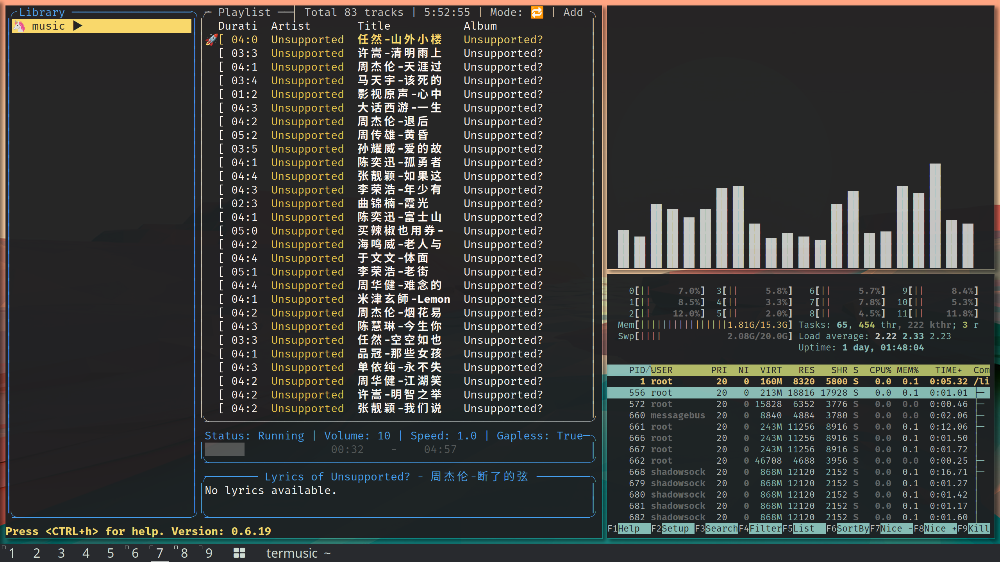
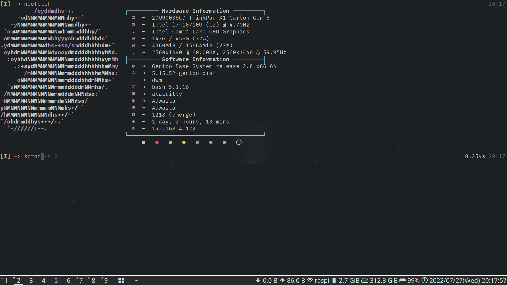
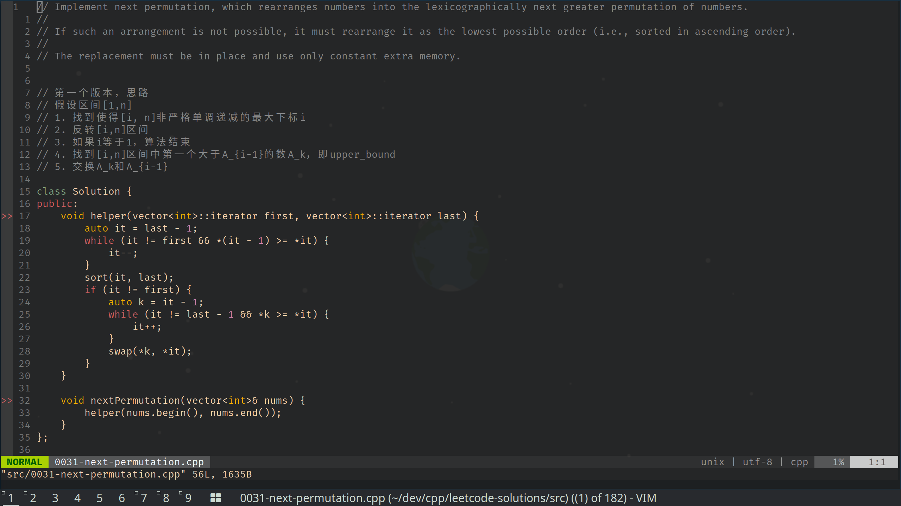

### My Dotfiles

备份一下自己的dotfiles，之前本来用dotdrop备份的，但是我老是会忘记指令啥的，干脆直接手动备份算了...

#### Preview

#### Softwares

- [dwm](https://dwm.suckless.org)
- [picom](https://github.com/yshui/picom)
- [alacritty](https://github.com/alacritty/alacritty)
- [qutebrowser](https://github.com/qutebrowser/qutebrowser)
- [fish](http://fishshell.com/)
- [vim](https://github.com/vim/vim)
- [tmux](https://tmux.github.io/)
- [feh](https://feh.finalrewind.org/)
- so on
